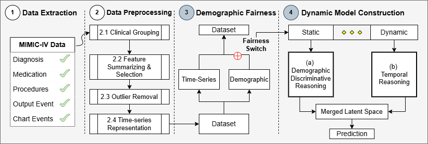

# Fairness-Aware Graph Neural Networks for ICU Length of Stay Prediction in IoT-Enabled Environments

**Abstract:** This study introduces a novel end-to-end framework designed to optimize patient outcomes and operational efficiency in intensive care units (ICUs) through fairness-aware and accurate length of stay (LOS) predictions within an IoT-enabled environment. Motivated by the concept of ‘‘fairness through unawareness,’’ our proposed framework employs a demographic feature exclusion strategy, preventing access to potentially discriminatory information, and thus enforcing an inductive bias that redirects learning toward non-discriminatory pattern dependencies. To address the loss of static information, we introduce a custom graph neural network that dynamically reconstructs patient relationships over time, adapting from static demographics to evolving inter-patient correlations via multi-modal embeddings (e.g., medications, procedures, vitals, conditions) and learned feature-driven edge formation. We evaluate our approach on **MIMIC-IV** across diverse time-series formats and demonstrate its superiority over top performing LOS prediction methods, showcasing notable performance improvements while maintaining comparable computational complexity. Additionally, we present a performance analysis highlighting our approach’s computational and predictive scalability across different graph sizes at inference, while underscoring its intrinsic ability to improve performance when deprived of demographic features by dynamically readjusting its expressive power, unlike all evaluated methodologies in this study. Finally, we present a comparative study against the literature’s top-performing LOS prediction approaches that highlights our method’s predictive superiority, demonstrating significant performance gains in predicting LOS exceeding 3 and 7 days, with improvements of up to 13.1% AUC and 10.3% ARP, and 14.1% AUC and 42.0% ARP, respectively.

##### Citing our study: 

```
To be published in IEEE Access.
```

For this study, we extended the widely adopted pre-processing pipeline proposed by Gupta et al. [ML4H](https://proceedings.mlr.press/v193/gupta22a/gupta22a.pdf), as illustrated in the figure below. Specifically, we build upon steps (1) and (2), which handle dataset construction and initial pre-processing, by incorporating two additional stages:
(3) demographic bias mitigation (i.e., fairness), and (4) dynamic model construction. These additions facilitate the management of discriminative features and ensure structural compatibility and pairing of all constructed models.



##### Citing MIMIC-IV Data Pipeline:
MIMIC-IV Data Pipeline code is available on [ML4H](https://github.com/healthylaife/MIMIC-IV-Data-Pipeline).

```
@InProceedings{gupta2022extensive,
  title = 	 {{An Extensive Data Processing Pipeline for MIMIC-IV}},
  author =       {Gupta, Mehak and Gallamoza, Brennan and Cutrona, Nicolas and Dhakal, Pranjal and Poulain, Raphael and Beheshti, Rahmatollah},
  booktitle = 	 {Proceedings of the 2nd Machine Learning for Health symposium},
  pages = 	 {311--325},
  year = 	 {2022},
  volume = 	 {193},
  series = 	 {Proceedings of Machine Learning Research},
  month = 	 {28 Nov},
  publisher =    {PMLR},
  url = 	 {https://proceedings.mlr.press/v193/gupta22a.html}
}
```
